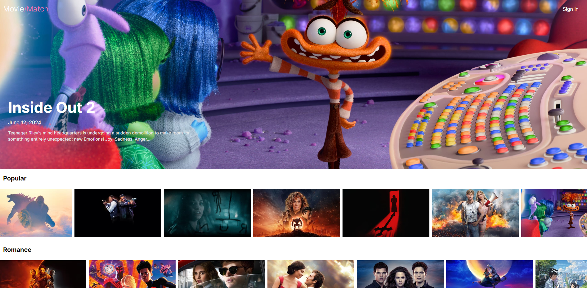

# Movie/Match : Un site de référence films & séries

L'objectif de ce site est de vous tenir au courant de l'actualité des films et séries, explorer la base de données pour trouver plus d'infos.

# Description

Ce projet a plusieurs objectifs :

- Être au courant de l'actualité cinéma et séries
- Avoir un compte pour créer des listes personnalisées ("Watch List")
- Trouver des informations détaillées sur les contenus (fiche film)

Le site est encore en développement

### Page d'accueil

Elle affiche les films de l'actualité et plusieurs sélections thématiques.

### Page de connexion "Sign In"

/!\ La création de compte et la connexion ne sont pas encore opérationnelles!

Prochain objectif : intégrer un système d'authentification.

En bref, cette page vous permet de vous connecter à votre compte.

# Les technologies

- React/Vite
- Tailwind

Utilisation de l'API The Movie Database.

Objectifs futurs : installer une base de données avec possibilité d'ajouter des films à la BDD, avec PostgreSQL.

# Aperçu

N'hésitez pas à faire un tour sur le lien Github pour avoir un aperçu !

https://apolline-diaz.github.io/Movie-App/

Bonne visite !
