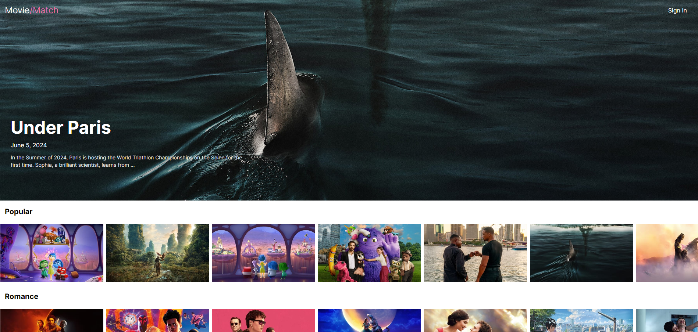

# Movie/Match

Site web d'actualité cinéma avec un répertoire issu de The Movie DataBase.

## Fonctions

- Découverture du répertoire : films du moment, films populaires et sélections thématiques
- Fiche détaillée pour chaque film : informations techniques et artistiques
- Page d'authentification (non fonctionnelle)

## Technologies

- HTML
- React / Vite
- Tailwind

Récupération des données via l'API The Movie Database.

## Utilisation

Essayez l'application en suivant ce lien :

https://apolline-diaz.github.io/Movie-App/

Cliquez sur l'image d'un film pour découvrir sa fiche détaillée.

## Objectifs futurs

- Ajouter une page avec une barre de recherche avec des filtres (catégories et mots-clés)
- Installer une base de données avec possibilité d'ajouter des films à la BDD, avec PostgreSQL
- Rendre fonctionnelle l'authentification avec possibilité de créer une liste de Favoris
- Ajouter une page pour les séries avec les mêmes fonctions
- Traduire le site en français
