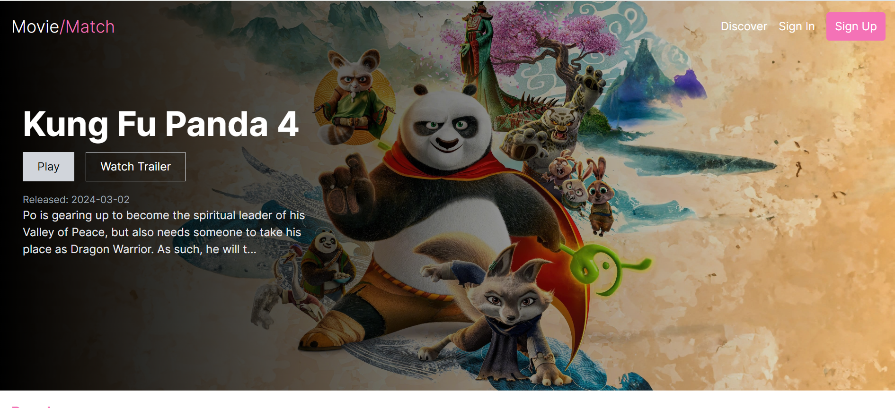
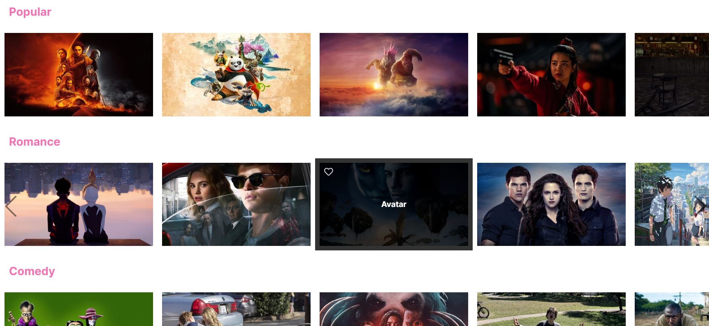
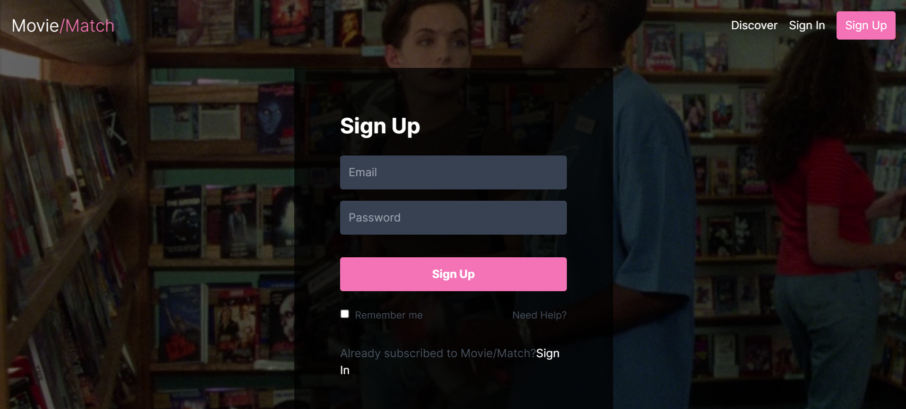

# Movie/Match : Un site de référence films & séries

L'objectif de ce site est de vous tenir au courant de l'actualité des films et séries, explorer la base de données pour trouver plus d'infos.

Le petit plus : ajouter une fonction pour vous proposer de nouveaux films et séries qui pourraient matcher avec vos goûts!

# Description

Ce projet a plusieurs objectifs :

- Être au courant de l'actualité cinéma et séries
- Avoir un compte pour créer des listes personnalisées ("Watch List")
- Trouver des informations détaillées sur les contenus (fiche film)
- Avoir des recommandations basées sur ses goûts

Le site est encore en développement, mais pour l'instant vous pouvez déjà y trouver :

### Page d'accueil

Elle affiche les films de l'actualité, mais aussi plusieurs sélections thématiques (les films du moment, les plus populaires, les mieux notés, ou sur un sujet spécial comme par exemple : "LGBT", etc).

Il sera possible de liker un film pour qu'il soit ajouté à votre Watch List (le petit coeur qui apparait quand vous survoler l'image d'un film).

### Page de connexion "Sign In"

// En cours de développement //

/!\ La création de compte et la connexion ne sont pas encore opérationnelles!
Les pages "Sign In" et "Sign Up" ne vous donnent pas encore accès à votre espace personnel.
C'est la prochaine étape de mon projet : développer avec MySQL l'authentification.

En bref, cette page vous permet de vous connecter à votre compte.

### Page d'inscription "Sign Up"

// En cours de développement //

En bref, cette page vous permet de créer votre compte.

### Page "Discover"

Cette page est le petit + de l'application.

Elle est faite pour découvrir de nouvelles références ciné et séries.
Elle se présente sous le même format que les applications de rencontres.
"Swipez à droite" pour liker le film ou "swiper à gauche" autrement.

L'objectif : chaque like enregistrera le film dans une liste de Favoris disponible dans le compte de l'utilisateur.

Et si possible : les films seront affichés en fonction de mots-clés pré-sélectionnés par l'utilisateur pour correspondre à ses goûts.

Les fonctions pour swiper l'image et l'enregistrement du like sont en cours de développement.

Pour l'instant,vous ne pouvez pas intéragir avec les images.

# Les technologies

J'ai décidé de travailler avec :

- React/Vite
- Tailwind
- MySQL

C'etait l'occasion de mieux découvrir et prendre en main React et Tailwind, que je pourrais utiliser pour de futurs projets personnels ou professionnels. Je les ai aussitôt adoptés!

La prochaine étape est de travailler avec MySQL pour mettre en place l'authentification de l'utilisateur.

J'utilise l'API de The Movie Database car elle est assez efficace pour le type d'usage que j'en fais, et vu mon projet personnel (ce n'était pas utile de choisir ImDB pour ce cas).

# Work In Progress

Ce projet est toujours en cours. J'ai beaucoup appris avec, et si la prise en main de React et Tailwind n'a pas été trop difficile car j'y avais déjà touché pour mon Portfolio, je continue d'apprendre le fonctionnement des routeurs.
La travail avec MySQL sera un nouveau défi ainsi que l'animation de la page Discover et son système de recommandation.

# Et la suite...

En plus de l'authentification, le challenge qui m'attend est l'ajout d'une fonction au site qui lui donnerait un vrai petit +.

Comme le principe des applications de rencontres, j'aimerais que l'utilisateur puisse indiquer ses goûts en sélectionnant des mots-clés.

Avec l'API de The Movie Database, il existe des mots-clés associés à chaque film.

Je veux créer une page qui fera apparaitre un film qui correspond aux mots-clés pré-sélectionnés. L'utilisateur pourra liker ou non le film et passer à la proposition suivante. Une fois sélectionné, le film sera ajouté à une liste de "Favoris".

A bientôt, pour la suite !

# Déjà un aperçu

N'hésitez pas à faire un tour sur le lien Github pour avoir un aperçu !

https://apolline-diaz.github.io/Movie-App/

Pas de panique si vous tombez sur une page blanche (je dois encore résoudre ce problème), vous pouvez sans soucis cliquer sur le logo "Movie/Match" (en haut à gauche), et vous atterissez bien sur la page d'accueil.

Vous pouvez aussi découvrir la page de connexion ou d'inscription en cliquant sur "Sign In" ou "Sign Up" dans la barre de navigation.

Bonne visite !
